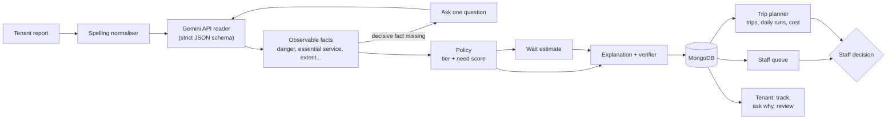

# FairTriage NT

**Fair, explainable triage of housing repairs for Northern Territory communities.**

A tenant describes a fault in their own words, in plain, hurried or
second-language English. FairTriage reads the report with the **Google Gemini
API**, works out what is observably wrong, decides how urgent it is, estimates
when a tradesperson can come, and explains all of it to the tenant and to
staff. Crews get recommended remote trips, daily runs around town and make-safe
call-outs, each with a map and a probable cost. **A person approves every
decision.**

Built for the CDU IT Code Fair, Trusted AI decision-support challenge:
*how might we help a coordinator prioritise urgent repairs across remote NT
communities without "efficiency" quietly pushing remote tenants to the back
of the queue?*


## Live demo

**Web app: https://fairtriage-nt-web-one.vercel.app/**

| Page | Link |
|---|---|
| Report a repair (tenants) | https://fairtriage-nt-web-one.vercel.app/report |
| Track a repair (tenants) | https://fairtriage-nt-web-one.vercel.app/track |
| Repair queue (staff) | https://fairtriage-nt-web-one.vercel.app/coordinator |
| Trip planner (staff) | https://fairtriage-nt-web-one.vercel.app/coordinator/trips |
| Fairness and trip policy (staff) | https://fairtriage-nt-web-one.vercel.app/coordinator/fairness |
| Backend API health | https://fairtriage-nt.vercel.app/api/health |

Staff pages need a staff sign-in. Tenants can report and track a repair
without an account, or create one to see all their repairs.

---

## What it does

**Sign-in and roles**
- **Tenants** can create an account with their mobile number and a password,
  and see every repair on it under **My repairs**. Signing in is optional:
  reporting and tracking by reference never need an account, so nobody facing
  an emergency is stopped by a login.
- **Staff** sign in with a username and see **only** the staff area; tenant
  pages send them to the queue. Tenants and visitors never see the staff area.
- **Administrators** add, switch off and reset staff accounts. There is no
  public staff sign-up; the first administrator comes from two settings.
- The server checks the session on **every** staff request, so hiding links is
  never the only protection. A repair is linked to a tenant account only when
  reported while signed in, or added with its reference and the account's
  own mobile, never by a matching mobile alone.

**For tenants**
- Report a repair in your own words, with your address and **mobile number**. At most **one**
  clarifying question, and only when the answer changes the priority
  ("Is this the only toilet in the house?").
- A clear answer that starts with **when to expect someone**, then why the job
  has its priority, your place in the queue, that the same repair in Darwin
  would be in the same place, and how to stay safe while you wait.
- A danger like fire, violence or someone hurt is told to **call 000 first**,
  before anything else, and staff are alerted to phone.
- **A text message** with your reference number, the message you were shown
  and a link to track it, so a lost reference never means a lost repair. A
  question from staff, or a change to your repair's priority, is texted too.
- **Track** the repair by reference number: a live estimate that counts down,
  what you were told on the day, and the trip or run that will reach you.
  **Lost your reference?** Enter your mobile number and it is texted to you
  again (the page never shows whether a number has repairs).
- **Ask why** your repair is where it is ("Why is my repair not first?",
  "Why was my repair moved down?") and get an answer built from your record and
  today's queue. Not satisfied? **Ask a person to review it.**

**For staff**
- A live, ranked queue with a **priority filter** (any mix of Immediate,
  Urgent, Routine, past target), an **area-by-area chart**, search, a
  "needs a phone call" list (danger, still unclear, tenant review requests),
  an **Immediate backlog alert** when make-safe work would miss its 4-hour
  target, and **CSV / Excel download** of exactly what is filtered.
- Each job shows the arithmetic behind its priority, flags that need a person,
  the live wait against what the tenant was told, and exactly what the tenant
  read. Approve, change the tier (with a reason the tenant sees), or **ask the
  tenant a question**: the answer is read with the report and the job is
  reassessed at once.
- A **trip planner** with a map: **remote trips** (routes, stops added on the
  way, charter flights, the crew that arrives soonest from any depot),
  **daily runs** in Darwin, Palmerston and nearby towns, and **make-safe
  call-outs** for Immediate jobs in town. Every repair has its own pin.
  Each trip shows why it is worth approving and a **probable cost** (fuel,
  charter, accommodation, labour, parts, contingency), compared with separate
  trips.
- **Approved trips** with live counts (active, completed, cancelled). Cancel an
  approval or take one job off a trip (with a reason): the jobs go back to the
  queue. Every change is kept in the trip's history.
- **Fairness measurements** from the live queue, and a **trip-policy what-if
  slider**: see how long remote routine work waits at each setting, against
  Darwin, with the trips and cost it takes, and set it with a recorded reason.

## Principles

1. **Danger first.** Anything that can hurt someone today (sparking, gas,
   sewage inside, a house that cannot be locked) is made safe before anything else.
2. **Where you live never changes your place in the queue.** Distance changes
   *when* a crew can arrive, never *where* a job ranks. The ranking code has no
   distance variable, and every job shows the rank it would have in Darwin.
3. **Every decision is explainable.** The model reads; it never decides.
   Priorities are plain arithmetic over facts a person can check. Tenant
   messages are checked before they are shown: no invented numbers, no promises.
4. **Ask, don't guess.** If one missing fact would change the outcome, the
   system asks one question and waits.
5. **Nothing dispatches itself.** The system recommends; staff decide, and the
   equity trade-off between cheap town-first work and fair remote service is
   shown, priced, and owned by a person.

## How it works



- **Reading with Gemini.** Each report goes to the Google Gemini API
  (`gemini-3.1-flash-lite`) with a strict JSON schema generated from the fact
  model, at temperature 0, with a prompt that defines every fact and its edge
  cases. The reply is validated before it is used. Gemini turns the message
  into a handful of facts a person could check (is someone in danger, is an
  essential service lost, how much of the house is affected); it never sets a
  priority. A tenant never waits on a busy model: each message gets at most
  12 seconds, a failing model is paused for five minutes, readings are cached,
  and if Gemini is busy or no key is set, a built-in offline reader produces
  the same facts at once and the job is flagged for review. OpenAI and Claude
  can be used through the same contract.
- **Ranking.** A strict tier ladder (Immediate, then Urgent, then Routine),
  then a need score within the tier from habitability, extent, containment
  and vulnerability. No distance term.
- **Waiting.** Booking lead time, plus the hours of same-trade work ranked
  ahead in the region divided by that trade's crews, plus mobilisation and
  travel. Immediate work uses on-call make-safe capacity. Remote routine jobs
  wait for the next trip. Recalculated live, so the queue and the tenant's
  page count down.
- **Remote trips.** The fastest route and slower alternatives over an NT road
  network (closed roads removed, restricted roads slowed, charter legs). Jobs
  on the way are added in need order, never quickest first, only while nobody
  is made to wait too long. The crew that arrives soonest goes, from any depot.
- **Daily runs and make-safe call-outs.** In Darwin, Palmerston and towns
  within daily reach, each run starts with the highest-ranked job still
  waiting for that trade and adds nearby jobs of the same trade in need order
  while the crew's day has room (at most 30 minutes' extra driving each).
  Visits are ordered by road; that never changes who is served. An Immediate
  job in town is a make-safe call-out of its own, never bundled.
- **Trip cost.** Each recommended trip shows a probable cost range: fuel,
  vehicle running costs and charter flights; accommodation, meals, freight
  and local vehicle hire; labour for every person for travel and on-site
  hours; parts and a stated contingency. Rates were checked against public
  sources (ATO allowances, NT diesel prices, Darwin trade rates, charter
  rates). Shown for budgeting and compared with separate trips, **never used
  to decide who is served**.
- **Ask why.** A tenant asks why their repair is where it is and gets an answer
  assembled from their record and today's queue: who is ahead and why (more
  dangerous, more need, or reported earlier), that where they live did not
  change their place, what changed since they reported (a staff decision and
  its reason, trips that were full), and what would move it up. A review
  request goes on the coordinator's phone list until someone records a
  decision.
- **Trip policy what-if.** How long remote routine work waits is set by one
  number: a community gets a trip when its oldest routine job has waited a
  multiple of its target. On the Fairness page a coordinator moves a slider
  and sees the remote wait, the ratio to Darwin, the trips a month and their
  cost at each setting, then sets it with a reason. The planner and every live
  remote wait follow at once.

The full design, test findings and evaluation are in
**[docs/DESIGN.md](docs/DESIGN.md)**.

## Tech stack

| Part | Technology |
|---|---|
| AI reader | **Google Gemini API** (strict JSON schema, temperature 0); OpenAI and Anthropic Claude through the same contract |
| Backend API | Python 3.10+, FastAPI, Pydantic |
| Request pipeline | LangGraph (the clarifying-question pause is stored in MongoDB) |
| Database | MongoDB (Atlas in production, pymongo); in-memory mongomock for tests |
| Routing | networkx over `reference/road_network.csv` |
| Web app | Next.js 16 (App Router), React 19, TypeScript, Tailwind CSS 4, SWR |
| Map | Leaflet + OpenStreetMap |
| Hosting | Vercel (backend and web app), MongoDB Atlas |

## Getting started

### Prerequisites

- **Python 3.10+** and **Node.js 20+**
- A **Gemini API key** (free at [Google AI Studio](https://aistudio.google.com/))
- **MongoDB**, one of:
  - [MongoDB Community Server](https://www.mongodb.com/try/download/community)
    installed on your computer ("Install as a service"), or
  - a free [MongoDB Atlas](https://www.mongodb.com/atlas) cluster (use its
    `mongodb+srv://...` connection string), or
  - Docker: `docker compose up` starts MongoDB and the backend together.

### 1. Clone and configure

```bash
git clone https://github.com/ShougataDas/Fairtriage-NT.git
cd Fairtriage-NT
```

Create a file named `.env` in this folder (it is never committed):

```
FAIRTRIAGE_EXTRACTOR=gemini
GEMINI_API_KEY=your-gemini-key
FAIRTRIAGE_MONGO_URL=mongodb://localhost:27017
```

Without a Gemini key the app still runs: the offline reader answers every
report and staff screens say which reader is live.

### 2. Backend

```bash
pip install -r requirements-dev.txt
python scripts/seed_demo.py
python -m uvicorn fairtriage.api:app --reload --port 8000
```

`seed_demo.py` fills the database with about 115 realistic demo requests
(it empties the database first), including clusters of jobs around
Palmerston, the inner city and the northern suburbs. At most 8 Immediate jobs
are left open, a few hours old; the rest are recorded as already made safe.
Demo data ages as the days pass, so seed again before a demo. It reads the
seed rows offline by default to save API quota; add `--model` to read them
with Gemini.

### 3. Web app (in a second terminal)

```bash
cd frontend
npm install
npm run dev
```

Open **http://localhost:3000**.

| Page | Who | What |
|---|---|---|
| `/signin` | Everyone | Tenant sign-in or account, and staff sign-in |
| `/my-repairs` | Signed-in tenants | Every repair on the account; add an earlier one by reference |
| `/report` | Tenants | Report a repair |
| `/track/<reference>` | Tenants | Progress, live estimate, trip update, ask why, ask for a review |
| `/coordinator` | Staff | Ranked queue, priority filter, alerts, phone list, chart, download |
| `/coordinator/requests/<id>` | Staff | Priority breakdown, flags, live wait, decision |
| `/coordinator/trips` | Staff | Remote trips, daily runs, make-safe call-outs, map, cost, approvals |
| `/coordinator/fairness` | Staff | Fairness measurements and the trip-policy what-if slider |
| `/coordinator/staff` | Administrators | Add, switch off and reset staff accounts |

The web app calls the backend through `/api`. To use a backend somewhere
else, set `FAIRTRIAGE_API=https://your-backend` before `npm run dev` or
`npm run build`.

With `make` installed (macOS / Linux), `make demo` and `make web` do steps 2
and 3.

## Configuration

Settings are read from environment variables, or from a `.env` file in the
project folder. `.env` is ignored by git, so keys never reach the repository.

| Variable | Default | Purpose |
|---|---|---|
| `FAIRTRIAGE_EXTRACTOR` | `offline` | Who reads messages: `gemini` (recommended), `openai`, `anthropic`, or `offline` |
| `GEMINI_API_KEY` | empty | Your Gemini API key |
| `FAIRTRIAGE_GEMINI_MODEL` | `gemini-3.1-flash-lite` | Gemini model to use |
| `OPENAI_API_KEY` / `ANTHROPIC_API_KEY` | empty | Keys if you use OpenAI or Claude instead |
| `FAIRTRIAGE_LLM_BUDGET_S` | `12` | Longest a tenant waits for the model before the offline reader answers |
| `TWILIO_ACCOUNT_SID` / `TWILIO_AUTH_TOKEN` / `TWILIO_FROM_NUMBER` | empty | Twilio account for text messages to tenants. Without all three, texts are composed and logged but not sent (demo mode), and tenants are told so |
| `FAIRTRIAGE_PUBLIC_WEB_URL` | `https://fairtriage-nt-web-one.vercel.app` | Where the tracking link in a text points |
| `FAIRTRIAGE_AUTH_SECRET` | empty | Long random value that signs sign-in sessions. **Set it in production** |
| `FAIRTRIAGE_ADMIN_USERNAME` | `admin` | Username of the first administrator |
| `FAIRTRIAGE_ADMIN_PASSWORD` | empty | Password of the first administrator: the account is created the first time it signs in. Without it nobody can reach the staff area |
| `FAIRTRIAGE_MONGO_URL` | `mongodb://localhost:27017` | MongoDB connection string (Atlas: `mongodb+srv://...`) |
| `FAIRTRIAGE_MONGO_DB` | `fairtriage` | Database name |

Every ranking weight, service target, wait assumption, trip rule and cost rate
is in [`config/policy.yaml`](config/policy.yaml), versioned, and shown on
screen where it is used.

## Tests

```bash
python -m pytest tests/ -q
python scripts/run_scenarios.py
python scripts/run_eval.py --extractor gemini --limit 300
```

The first runs 623 tests on an in-memory database, so no server, network or
API key is needed (the Gemini path is tested with a stand-in client). The
second runs the 16 demo scenarios in [TEST_CASES.md](TEST_CASES.md). The third
scores reading against the 12,000-row dataset in `data/` with Gemini (omit
`--extractor` to score the offline reader).

To run the same tests against a real MongoDB, set
`FAIRTRIAGE_TEST_MONGO_URL=mongodb://localhost:27017` first.

The suite covers about 100 maintenance scenarios (electrical, gas, water,
sewage, storm, structural, security, falls, asbestos, remote water supply,
appliances, pests and more), emergencies, hedged, second-language, Aboriginal
English and Kriol wording, fairness (rank never depends on location; cost never
changes a plan), the trip planner and daily runs, wait times, Ask why, staff
decisions, the trip policy, the API and the exports.

## API

JSON endpoints under `/api` (interactive docs at `http://localhost:8000/docs`):

| Method | Endpoint | Purpose |
|---|---|---|
| POST | `/api/auth/register` | Tenant creates an account `{phone, password, name?}` |
| POST | `/api/auth/signin` | Sign in `{kind: tenant\|staff, identifier, password}` (sets a session cookie) |
| POST | `/api/auth/signout` | Sign out |
| GET | `/api/auth/me` | Who is signed in, or null |
| GET | `/api/me/requests` | A tenant's repairs |
| POST | `/api/me/claim` | Add an earlier repair `{reference}` (must match the account's mobile) |
| GET / POST | `/api/staff/users` | Administrators: list or add staff accounts |
| POST | `/api/staff/users/{id}/active`, `/password` | Administrators: switch an account on or off, reset its password |
| POST | `/api/requests` | Lodge a report `{text, community, address, phone, vulnerability[]}`; `phone` must be an Australian mobile; the tenant is texted |
| POST | `/api/requests/{id}/clarify` | Answer a question (the system's or a coordinator's) |
| GET | `/api/requests/{id}` | Full record: assessment, live wait, history, trip |
| POST | `/api/requests/{id}/why` | Tenant asks why: an answer built from the record |
| POST | `/api/sms/resend` | Lost reference: text the references on this mobile to it `{phone}` |
| POST | `/api/requests/{id}/review` | Tenant asks a person to review it |
| POST | `/api/requests/{id}/decision` | Approve, override (with reason) or ask the tenant |
| GET | `/api/queue` | Ranked queue (`?tier=`, `?community=`, `?order=cost` for contrast) |
| GET | `/api/contacts` | The phone list: danger, unclear, withdrawals, review requests |
| GET | `/api/alerts` | Immediate work past the make-safe target, by trade and region |
| GET | `/api/export` | Download `?format=csv\|xlsx&scope=queue\|all&tier=Immediate,Urgent&past=true` |
| GET | `/api/trips/preview` | Recommended trips, daily runs and call-outs, with maps, benefits and cost |
| POST | `/api/trips/plan` | Approve all, or one with `?anchor=<id>` |
| GET | `/api/trips` | Approved trips with status, cost and history |
| POST | `/api/trips/{id}/cancel` | Withdraw an approval `{reason}`: jobs return to the queue |
| POST | `/api/trips/{id}/remove` | Take one job off a trip `{request_id, reason}` |
| POST | `/api/trips/{id}/complete` | Mark the trip's jobs completed |
| GET / POST | `/api/policy/trip-threshold` | What-if scenarios; set the trip threshold `{multiple, reason}` |
| GET | `/api/metrics/equity` | Fairness measurements |
| GET | `/api/health` | Service, database, policy and reader status |

## Project structure

```
fairtriage/          Python backend
  api.py             HTTP API (and the original server-rendered pages)
  extract.py         Readers: Gemini API (and OpenAI / Claude), offline reader, cache, fallback
  schemas.py         The fact model: drives Gemini's JSON schema and validation
  normalise.py       Spelling normaliser that never touches hazard words
  graph.py           LangGraph pipeline with the clarifying-question pause
  policy.py          Tier and need score: pure arithmetic, no model
  queue.py           Queue position and the location-free Darwin rank
  wait.py            Wait estimates
  explain.py         Tenant and staff explanations, and their verifier
  auth.py            Sign-in, roles, sessions, tenant and staff accounts
  askwhy.py          The tenant's "why" answer and review requests
  sms.py             Text messages to tenants (Twilio, or demo mode) and lost-reference resend
  service.py         Lodging, questions, assessments, decisions, live waits, phone list
  scheduler.py       Trip planner: remote trips, daily runs, make-safe call-outs
  routing.py         Road network and alternative routes
  cost.py            Probable trip cost
  whatif.py          Trip-policy what-if scenarios
  tripsettings.py    The coordinator's trip-threshold setting and its history
  metrics.py         Fairness measurements
  reference.py       Places, distances, crews, road status
  db.py              MongoDB storage with append-only history
  export.py          CSV and Excel export
frontend/            Next.js web app (presentation only; calls the API)
config/policy.yaml   Every weight, threshold and rate
reference/           Communities, road network, crews, road status
scripts/             Seeding, evaluation, scenario runner, data builders
tests/               623 tests
docs/DESIGN.md       Design notes, test findings, evaluation
```

## Deployment (Vercel)

The backend and the web app deploy as **two Vercel projects from this one
repository**, with the data in **MongoDB Atlas**.

**1. Database: MongoDB Atlas (free)**
- Create a free cluster and a database user.
- Under *Network Access*, allow `0.0.0.0/0`: Vercel functions have no fixed IP address.
- Copy the connection string (`mongodb+srv://...`).
- Optionally fill it with demo data from your own computer:
  `FAIRTRIAGE_MONGO_URL="mongodb+srv://..." python scripts/seed_demo.py`

**2. Backend project**
- *New Project* → import this repository. Root Directory `./`, preset
  **FastAPI**. It finds the app through `app.py`.
- Environment variables: `FAIRTRIAGE_AUTH_SECRET` = a long random value,
  `FAIRTRIAGE_ADMIN_PASSWORD` = the first administrator's password (sign in
  as `admin`, then add staff); `FAIRTRIAGE_MONGO_URL` = your Atlas string;
  `FAIRTRIAGE_EXTRACTOR` = `gemini` and `GEMINI_API_KEY` = your key; and for
  text messages `TWILIO_ACCOUNT_SID`, `TWILIO_AUTH_TOKEN`, `TWILIO_FROM_NUMBER`.
- Deploy, then open `https://<backend>.vercel.app/api/health`: it should
  report `"database": "connected"` and the reader in use.

Vercel installs only `requirements.txt` (the server). Tests, seeding and
evaluation use `requirements-dev.txt`. `.vercelignore` leaves the web app,
tests and dataset out of the backend bundle.

**3. Web app project**
- *New Project* → import the same repository again. Root Directory
  **`frontend`**, preset **Next.js**.
- Environment variable: `FAIRTRIAGE_API` = `https://<backend>.vercel.app`
  (no trailing slash). The `/api` proxy is fixed at build time, so redeploy
  after changing it.

## Limitations

- **Placeholder data:** crew numbers and their split by trade, booking lead
  times, mobilisation times, some cost rates and community coordinates are
  placeholders; road distances and speeds are approximate. Remote service
  targets are unverified (see `config/policy.yaml`).
- **Gemini free tier:** in testing, the free tier was often busy; a paid or
  higher-quota key is recommended for real use. The reading evaluation should
  be re-run with Gemini on such a key.
- **Text messages need a paid Twilio account and a sender:** until the three
  Twilio settings are added, texts run in demo mode (composed and logged, not
  sent). Twilio trial accounts cannot send custom messages, and an Australian
  sender number needs Twilio's regulatory approval, which can take several
  business days; a number from another country can be used meanwhile.
- **Accounts are not verified by text:** a tenant account is not checked
  against the mobile by a code, which is why repairs are never linked by a
  matching mobile alone. Department single sign-on would replace staff
  passwords in production.
- **Synthetic dataset:** labels were derived by rule, not by people. A
  human-labelled sample is needed before quoting accuracy.
- **Designed without the communities it concerns.** Before real use it would
  need community consultation, real maintenance data, and governance over who
  sets the weights and the trip policy.

More in [docs/DESIGN.md](docs/DESIGN.md#known-limitations).
